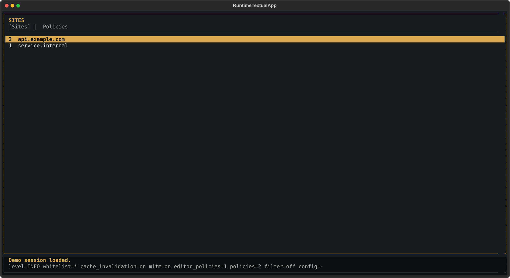
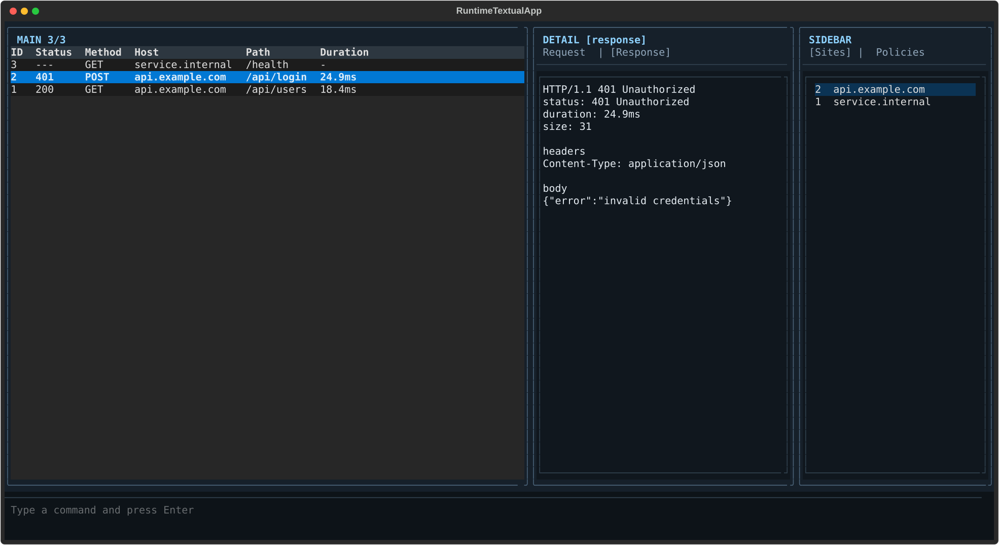
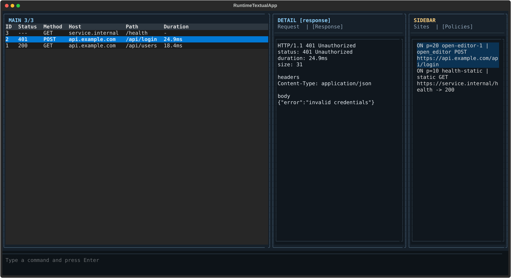

# proxyscope

`proxyscope` is an interactive HTTP/HTTPS debugging proxy with a terminal UI.  
It supports request/response inspection, response editing, replay, and both static and editor-based policy rules.

## Features

- HTTP forward proxy and HTTPS via `CONNECT`
- Optional TLS interception (MITM) with a local CA
- Runtime control directly in the TUI
- Request/response log with details, filters, export (`json`, `har`), and session persistence
- Policy type `open_editor` (manually edit responses)
- Policy type `static_response` (serve static responses)

## Requirements

- Python `>=3.13`
- Poetry `2.x` (for development)

## Installation

From the repository (recommended for development):

```bash
git clone <repo-url>
cd proxyscope
poetry install
```

Install from PyPI:

```bash
pip install proxyscope
```

## Start

Default start:

```bash
poetry run proxyscope --host 127.0.0.1 --port 8080
```

With a static configuration file:

```bash
poetry run proxyscope --config ./runtime-config.json
```

Without TUI:

```bash
poetry run proxyscope --no-ui
```

Available CLI options:

- `--host <ip-or-hostname>`
- `--port <port>`
- `--config <path>`
- `--mitm on|off`
- `--certs-dir <path>`
- `--no-ui`

## Use Proxy With A Client

Example with `curl`:

```bash
curl -x http://127.0.0.1:8080 http://httpbin.org/get
curl -x http://127.0.0.1:8080 https://httpbin.org/get
```

## Screenshots

### Overview



### Request Detail



### Policies Sidebar



Regenerate screenshots:

```bash
poetry run python scripts/generate_readme_screenshots.py
```

## Runtime Commands (TUI)

- `help`, `?`
- `clear`
- `sites`
- `loglevel <DEBUG|INFO|WARNING|ERROR>`
- `filter [show|clear|host|method|status|text] ...`
- `find <text>`
- `find clear`
- `export <json|har> <path>`
- `session <save|load> <path>`
- `mitm [show|on|off|certs-dir <path>]`
- `whitelist [show|add|remove|clear] ...`
- `cache [show|on|off|toggle]`
- `config [show|save [path]|reload]`
- `policy [show|add-editor|add-editor-prefix|remove-editor|clear-editor|add-static|add-static-prefix|set-priority|edit|remove|enable|disable] ...`
- `quit`, `exit`, `q`

## Keyboard Shortcuts (TUI)

- `Tab` / `Shift+Tab`: Cycle focus through panes
- `Enter`: Open request detail or execute the current command input
- `Shift+S`: Toggle sidebar (Sites)
- `Shift+P`: Open Policies sidebar
- `Shift+B`: Go back in the current view
- `Shift+M`: Create an editor policy from the selected request
- `Shift+R`: Edit and resend the selected request
- `Shift+A` / `Shift+U`: Add/remove selected site to/from whitelist
- `Shift+D` / `Shift+E`: Disable/enable selected policy
- `Shift+I`: Open selected policy in external editor
- `Shift+X`: Remove selected policy

## Static Configuration (`runtime-config.json`)

The file can be loaded at startup via `--config`.  
If a `config_path` is attached, many runtime changes are automatically persisted to this file.

Example:

```json
{
  "log_level": "INFO",
  "log_whitelist": [
    "api.example.com",
    "service.internal"
  ],
  "cache_invalidation_enabled": true,
  "mitm_enabled": true,
  "mitm_certs_dir": "certs",
  "policies": [
    {
      "name": "health-static",
      "enabled": true,
      "priority": 20,
      "action": {
        "type": "static_response",
        "status_code": 200,
        "reason": "OK",
        "headers": {
          "Content-Type": "application/json",
          "Cache-Control": "no-store"
        },
        "body": "{\"status\":\"ok\",\"source\":\"proxyscope\"}"
      },
      "match": {
        "methods": ["GET"],
        "url_exact": "https://service.internal/health"
      }
    },
    {
      "name": "edit-login-response",
      "enabled": true,
      "priority": 10,
      "action": {
        "type": "open_editor"
      },
      "match": {
        "methods": ["POST"],
        "url_prefix": "https://api.example.com/v1/login"
      }
    }
  ]
}
```

Start with file:

```bash
poetry run proxyscope --config ./runtime-config.json
```

## MITM / Certificates

On startup, proxyscope automatically creates missing CA files under `<mitm_certs_dir>/ca`.  
For HTTPS interception, the root certificate `<mitm_certs_dir>/ca/mitm-ca.crt` must be trusted by your client/browser.

## Tests

```bash
poetry run python -m unittest discover -s tests -p "test_*.py" -v
```

## Architecture And Quality Checks

The current architecture, module boundaries, and refactoring roadmap are
documented under [`docs/architecture/`](docs/architecture/README.md) and
[`docs/architecture-refactoring-plan.md`](docs/architecture-refactoring-plan.md).

Run the local quality gates:

```bash
poetry check
poetry run ruff format --check proxyscope tests scripts
poetry run ruff check proxyscope tests scripts
poetry run pyright
poetry run coverage run -m unittest discover -s tests -p "test_*.py"
poetry run coverage report
poetry build
```

## License

MIT, see [LICENSE](LICENSE).
