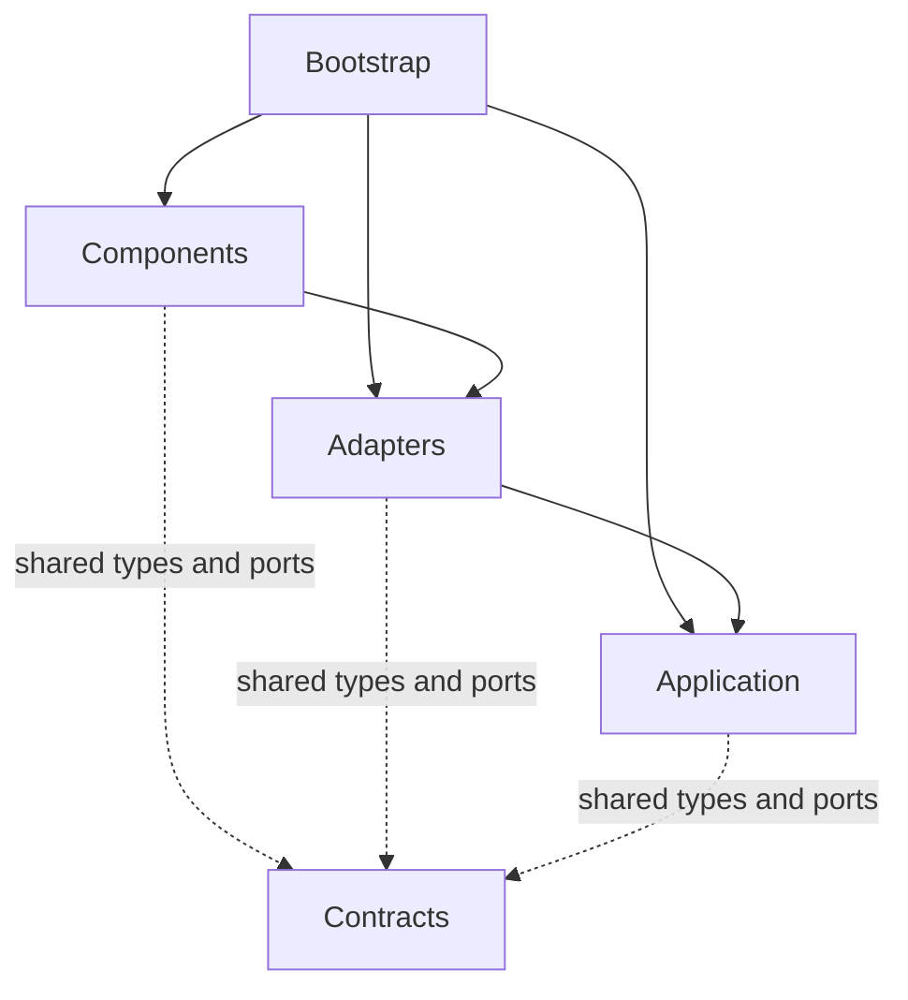

# Architecture

proxyscope separates transport handling, shared application behavior, and optional
features. Bootstrap assembles them into one runtime. This document describes the
boundaries and design choices; implementation details belong in code and tests.

## Module Responsibilities

| Package | Responsibility |
| --- | --- |
| [bootstrap](../../proxyscope/bootstrap) | Startup, dependency construction, configuration loading, and resource shutdown. |
| [application](../../proxyscope/application) | Shared use cases, exchange processing, rule management, and runtime state. |
| [adapters](../../proxyscope/adapters) | Concrete transport, persistence, terminal UI, editor, and service bindings. |
| [components](../../proxyscope/components) | Optional features with their own behavior and runtime contributions. |
| [contracts](../../proxyscope/contracts) | Shared value types, messages, and ports, independent of runtime implementations. |

The two component locations serve different purposes: `application/components`
owns the shared registration and lifecycle implementation; top-level `components`
contains feature implementations, such as the mockserver.

## Dependency Boundaries

The arrows below show how modules are wired through adapters. They are not
a complete Python import graph or a request-flow diagram:

Application code does not import bootstrap, concrete adapters, or feature
components. Bootstrap selects implementations and injects shared instances.
Transport-specific code stays in adapters; the shared processing pipeline works
with exchange models and ports.

The terminal UI is an optional runtime component enabled through runtime
configuration. It receives only the event
bus and journal ports through its component context, projecting runtime events
and captured exchanges without direct access to configuration or rule services.
The Textual dependency remains isolated in that optional component.

Components bind to adapters through injected ports. Event and journal adapters
provide access to the shared application runtime.
They do not import application modules or receive the application-service container,
concrete event bus, journal, or rule store. Shared types and integration contracts
live in `contracts`, which imports none of the implementation layers.

Rule changes are requests on the event bus. An application handler validates and
applies them to the shared store, then publishes a correlated result. Rule snapshots,
scenario ownership, and activation use the same message boundary. Components do not
populate the store or provide callbacks to the rule engine. Rule-management handlers
currently run inline, allowing callers to check results before reporting success;
this is not an asynchronous command-completion workflow.

This is a separation of responsibilities, not a claim that every I/O operation
already has an adapter. For example, configuration serialization remains in the
application package, and mock scenario import/export belongs to the component.

## Request Processing

Transport adapters handle HTTP connections, forwarding, tunnels, and TLS.
For inspected HTTP exchanges, they call the shared application pipeline through
the runtime context. Opaque HTTPS tunnels do not expose HTTP messages to that
pipeline.

The pipeline applies request middleware and traffic rules, records traffic, and
decides whether to return a local response or forward upstream. Response processing
applies the configured transformations and records the result. Components reuse
this path rather than introducing their own HTTP server or rule engine.

Traffic rules describe matching and actions on requests or responses. The mockserver
owns a simpler scenario and static-response syntax, then projects active scenarios
to scoped runtime traffic rules through the event bus. `open_editor` is a response-phase
traffic action; static responses use the `respond` action.

## Component Integration

A component exposes contributions such as commands, event handlers, shortcuts,
middleware, and activation hooks. The component manager registers and removes
active contributions. It manages runtime activation, not package discovery or
installation; bootstrap explicitly constructs the available components.

The component context in `contracts` carries prepared commands and access ports, not the
application-service container. Adapters bind core commands to application services;
feature components supply their own commands. Management commands can be registered
with the always-active core when they must remain available while a feature is
disabled, as with mock scenario preparation.

To add a feature, keep its behavior in `components`, reuse shared rule and exchange
models, and request external capabilities through narrow ports. Implement service
or technology bindings in `adapters`, then wire them in bootstrap. Add focused
tests for activation, deactivation, and the feature's effect on shared processing.

## State And Events

- The journal is a bounded in-memory view of captured requests and responses.
  Its adapter returns snapshots for components; it is not persistent history.
- The event bus distributes runtime notifications. An optional event-store adapter
  persists history. Events complement direct request processing; they do not
  replace the synchronous request/response path.
- Artifacts track operations such as replay and response editing, including their
  results and captured payload references. They are separate from configuration.
- Configuration describes settings, the event store, and traffic rules at the
  root. `components` describes activation and `components.configurations` holds
  component-owned JSON objects; the
  global parser only validates their container and JSON shape. The mockserver's
  scenario syntax and schema live with that component. Parsers and serializers
  define the supported format; there is no legacy migration path for
  configuration or embedded mock rules.

Bootstrap owns the lifetime of shared resources. Shutdown stops network activity,
cancels pending interactive work, and closes event processing and persistence.
Components use injected resources rather than constructing a separate runtime.

## Sources Of Truth

[Architecture tests](../../tests/architecture/test_import_boundaries.py) enforce
import boundaries. [Bootstrap tests](../../tests/bootstrap) exercise composition
and lifecycle, while [component tests](../../tests/components) cover feature behavior.
For exact signatures, configuration fields, command syntax, and processing order,
consult the corresponding package and its tests.

Update this document when ownership, dependency direction, or an integration
contract changes. New commands, fields, helper classes, and internal file moves
normally need no architecture documentation change.

The [archived architecture](../architecture_old/README.md) contains earlier designs
and implementation plans; it is not authoritative for the current code.
